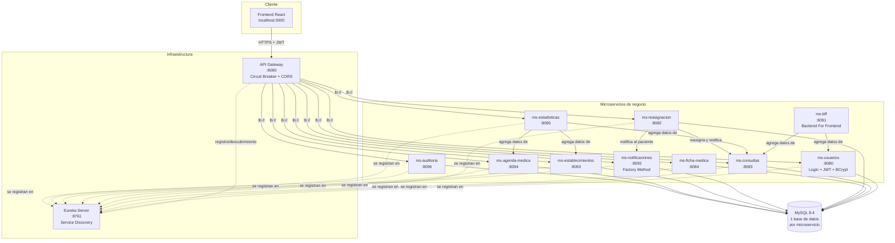
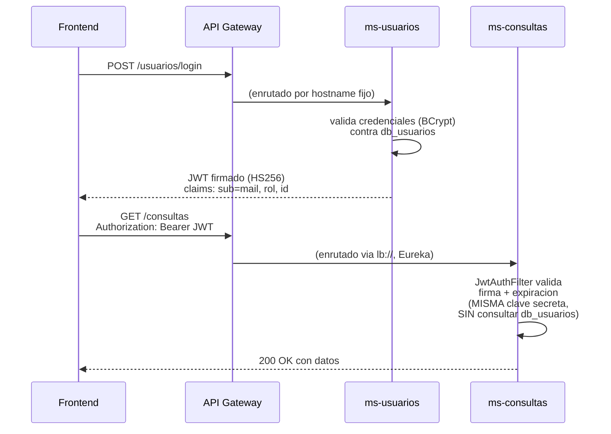

# Arquitectura del sistema — RedNorte

Documento de arquitectura del caso semestral **DSY1106 — Desarrollo Fullstack III**.
Describe los patrones aplicados, las decisiones de diseño y por qué se eligieron,
con base en el sistema real implementado (no un diseño teórico previo).

**Integrantes:** Kevin Joan Michel Pinochet Requena (jefe de proyecto), Taylor Andrey Medolphe Forero.

---

## 1. Visión general

RedNorte es un sistema de gestión de consultas médicas, fichas clínicas y
reasignación automática de citas, construido como **10 microservicios**
independientes en Spring Boot, con un frontend en React, orquestados con
Docker Compose.



> `ms-usuarios` queda fuera de Eureka por una incompatibilidad real de
> versiones (corre en Spring Boot 4.0.6, mientras el resto del ecosistema
> usa Spring Boot 3.5.13 + Spring Cloud 2025.0.0 — Spring Cloud para Boot
> 4.0 aún estaba en fase milestone al momento del desarrollo). El Gateway
> lo enruta por hostname fijo de contenedor en vez de `lb://`.

---

## 2. Patrones de diseño aplicados

### 2.1 Microservicios independientes con base de datos propia

Cada microservicio de negocio tiene su propia base de datos MySQL
(`db_usuarios`, `db_consultas`, `db_ficha`, `db_reasignacion`,
`db_notificaciones`, `db_establecimientos`, `db_agenda`, `db_auditoria`).
Ningún microservicio hace JOIN directo contra la base de otro: si necesita
datos de otro dominio, los pide vía HTTP (por ejemplo, `ms-estadisticas`
le pide a `ms-consultas`, `ms-agenda-medica` y `ms-establecimientos` sus
datos crudos y los agrega él mismo).

**Por qué:** aislar el esquema de cada dominio evita que un cambio en la
tabla de consultas rompa accidentalmente el módulo de auditoría, y permite
escalar o migrar cada base de datos de forma independiente si el sistema
creciera más allá del alcance académico.

### 2.2 API Gateway (Spring Cloud Gateway)

Punto único de entrada para el frontend (`:8090`). Centraliza:
- **Enrutamiento** hacia los 10 microservicios (`Path=/consultas/**` → `ms-consultas`, etc.)
- **CORS global** — es la única capa que agrega los headers
  `Access-Control-Allow-*`. Los microservicios individuales no agregan CORS
  propio: cuando ambas capas lo hacían, el navegador recibía el header
  duplicado y bloqueaba toda la respuesta (`The 'Access-Control-Allow-Origin'
  header contains multiple values`) — un bug real que se encontró y corrigió
  durante el desarrollo.
- **Circuit Breaker** (ver 2.3)

**Por qué:** sin Gateway, el frontend tendría que conocer las 10 URLs e
implementar CORS y manejo de fallos en cada llamada. Con Gateway, el
frontend solo conoce `localhost:8090`.

### 2.3 Circuit Breaker (Resilience4j)

Cada ruta del Gateway tiene un Circuit Breaker configurado
(`ms-usuarios-cb`, `ms-consultas-cb`, etc., con `sliding-window-size: 10`,
`failure-rate-threshold: 50`), y un `FallbackController` dedicado que
responde de forma controlada si el microservicio destino no responde.

**Por qué:** si `ms-notificaciones` se cae, una consulta no debería fallar
completa — el Circuit Breaker evita que un microservicio caído arrastre
al resto del sistema (cascading failure).

### 2.4 Service Discovery (Netflix Eureka)

El Gateway enruta por nombre lógico de servicio (`lb://ms-consultas`) en
vez de IP/hostname fijo, resolviendo la instancia real a través de Eureka.

**Por qué:** permite escalar un microservicio a varias instancias sin
reconfigurar el Gateway. Se verificó el problema real de no tener esto:
antes de registrar `ms-consultas`/`ms-ficha-medica`/`ms-reasignacion` en
Eureka, el Gateway les llegaba por hostname Docker fijo
(`http://cnt-ms-consultas:8083`), lo cual rompe si el contenedor cambia
de nombre o se escala.

### 2.5 Backend For Frontend — BFF (`ms-bff`)

Agrega datos de `ms-consultas` y `ms-usuarios` en una sola respuesta
(`GET /bff/dashboard`) para el panel del administrador, en vez de que el
frontend haga 2+ llamadas y combine los datos él mismo.

**Por qué:** el dashboard de admin necesita totales de consultas y
usuarios al mismo tiempo; el BFF evita ese trabajo de agregación en el
cliente y permite cambiar qué microservicios alimentan el dashboard sin
tocar el frontend.

### 2.6 Repository (Spring Data JPA)

Todos los microservicios con persistencia usan `JpaRepository` para el
acceso a datos, separado de la capa de servicio (lógica de negocio) y de
controller (HTTP).

**Por qué:** separar estas capas permite testear la lógica de negocio
con Mockito sin necesitar una base de datos real — los 49 tests unitarios
del proyecto mockean el `Repository` y prueban el `Service` en aislamiento.

### 2.7 Factory Method (`ms-notificaciones`)

`NotificacionCreator` es una interfaz con el método `crear(usuarioId,
contexto)`. Cada tipo de evento tiene su propia implementación concreta:
`CambioEstadoConsultaCreator` y `ReasignacionCreator`. `NotificacionService`
recibe automáticamente (vía inyección de Spring) la lista de todos los
creators disponibles, y selecciona el correcto según `tipoEvento()`.

```java
public interface NotificacionCreator {
    Notificacion crear(String usuarioId, Map<String, Object> contexto);
    String tipoEvento();
}
```

**Por qué:** antes de este refactor, la lógica de construir cada tipo de
notificación vivía como un `switch` dentro del servicio. Agregar un nuevo
tipo de evento (por ejemplo, un recordatorio de cita) significaba editar
ese switch. Con Factory Method, se agrega una nueva clase que implemente
la interfaz y se registra solo por estar anotada `@Component` — el
servicio no se modifica. Este patrón está conectado al flujo real: cuando
`ms-reasignacion` reasigna una cita exitosamente, llama a
`POST /notificaciones/reasignacion`, que usa `ReasignacionCreator` para
construir el mensaje correcto.

---

## 3. Seguridad: JWT distribuido sin re-validación contra base de datos



Solo `ms-usuarios` **genera** tokens (login con BCrypt contra su propia
base de datos). Los otros 9 microservicios solo **validan** la firma y
expiración del token, usando la misma clave secreta compartida, sin
ninguna llamada de red ni consulta a `db_usuarios`.

**Por qué:** si cada microservicio tuviera que llamar a `ms-usuarios` para
validar cada request, se generaría un cuello de botella y una dependencia
dura entre todos los microservicios y uno solo. Validar la firma
localmente es instantáneo y no depende de que `ms-usuarios` esté arriba.

**Llamadas internas y propagación del token.** Cuando un microservicio
llama a otro (`ms-bff` → `ms-consultas`/`ms-usuarios`, `ms-estadisticas` →
4 microservicios, `ms-reasignacion` → `ms-consultas` y `ms-notificaciones`),
reenvía el header `Authorization` del usuario original. Esto se descubrió
como un bug real durante el desarrollo: al activar JWT en todos los
microservicios, esas llamadas internas empezaron a fallar con 401 porque
no llevaban ningún token — se corrigió agregando el reenvío explícito del
header en cada llamada servidor-a-servidor.

---

## 4. Testing y CI/CD

- **JaCoCo** configurado en los 11 módulos backend, generando reporte de
  cobertura en cada build (`mvn test`), sin regla de mínimo bloqueante
  todavía (para no romper el pipeline mientras se completa cobertura).
- **49 tests unitarios** (JUnit 5 + Mockito) escritos para los 6
  microservicios que no tenían ninguno, sumados a los tests ya existentes
  en `ms-usuarios`, `ms-establecimientos`, `ms-agenda-medica` y
  `ms-auditoria`.
- **GitHub Actions** (`.github/workflows/ci-cd.yml`) ejecuta en cada push:
  tests de `ms-usuarios` (job propio) + tests de los otros 9 microservicios
  (matrix paralela) + build del JAR + build de imagen Docker, publicando
  reportes de Surefire y JaCoCo como artefactos descargables.

---

## 5. Decisiones de versión

| Componente | Versión | Razón |
|---|---|---|
| Spring Boot (9 de 10 microservicios) | 3.5.13 | Estable, compatible con Spring Cloud 2025.0.0 |
| Spring Cloud | 2025.0.0 | Release train compatible con Boot 3.5.x |
| `ms-usuarios` (Backend-usuarios) | Spring Boot 4.0.6 | Código del compañero, no modificado; queda fuera de Eureka por incompatibilidad de Spring Cloud para Boot 4.0 (aún en milestone) |
| Java | 17 | LTS, requerido por Spring Boot 3.x |
| MySQL | 8.4 | Una instancia, 8 bases de datos lógicas separadas |
| JWT (`jjwt`) | 0.12.6 | Algoritmo HS256, clave compartida |
| springdoc-openapi | 2.3.0 | Swagger UI compatible con Spring Boot 3.x |
| JaCoCo | 0.8.12 | Última versión estable al momento del desarrollo |

## 6. Problemas reales encontrados y resueltos

Esta sección documenta bugs reales descubiertos durante el desarrollo —
no son hipotéticos, se encontraron probando el sistema en ejecución real.

1. **CORS duplicado.** 11 controllers tenían `@CrossOrigin` propio además
   del CORS global del Gateway. El navegador recibía el header
   `Access-Control-Allow-Origin` con dos valores y bloqueaba toda
   respuesta. Solución: el Gateway es la única fuente de CORS; se quitó
   de los 11 controllers y de un `CorsConfig.java` adicional en
   `ms-consultas`.

2. **Recursión infinita en `GET /usuarios`.** El modelo `Usuario` ↔
   `Persona` (relación `@OneToOne` bidireccional) y `Usuario` ↔ `Rol`
   (relación `@ManyToOne`/`@OneToMany`) generaban un ciclo: Hibernate
   cargaba ambos lados en modo `EAGER`, y Jackson intentaba serializar el
   ciclo completo, colgando la petición indefinidamente con 12 usuarios en
   la base. Solución: `@JsonManagedReference`/`@JsonBackReference` para
   cortar el ciclo de serialización, y `FetchType.LAZY` para cortar el
   ciclo de carga en la capa de datos.

3. **Llamadas internas sin token.** Al activar JWT en los 9 microservicios
   que no lo tenían, las llamadas servidor-a-servidor (BFF, Estadísticas,
   Reasignación) empezaron a fallar con 401 porque nunca habían necesitado
   enviar un token. Solución: reenviar el header `Authorization` del
   usuario original en cada llamada interna.

4. **Service Discovery incompleto.** `ms-consultas`, `ms-ficha-medica` y
   `ms-reasignacion` no estaban registrados en Eureka; el Gateway los
   enrutaba por hostname Docker fijo. Solución: agregar el cliente Eureka
   y cambiar las rutas del Gateway a `lb://`.

## 7. Conclusión

La arquitectura de RedNorte no es un diagrama hecho antes de programar:
refleja decisiones tomadas (y corregidas) sobre un sistema real en
ejecución, con los problemas que efectivamente aparecieron al integrar
10 microservicios independientes — duplicación de responsabilidades entre
capas, dependencias circulares de datos, y la necesidad de un punto único
de coordinación (Gateway + Eureka) para que el conjunto se comporte como
un sistema, no como 10 aplicaciones sueltas.
